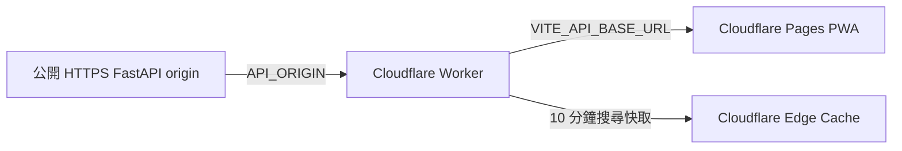
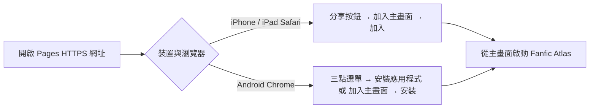

# Fanfic Atlas PWA：Cloudflare Pages 與 Worker 部署指南

本指南將 **React PWA 靜態前端**部署至 Cloudflare Pages，並以獨立的 Cloudflare Worker 代理既有 FastAPI 搜尋與閱讀服務。Worker 只會將 `/api/search` 和 `/api/reader` 轉發至已部署的 FastAPI origin；它**不會**在邊緣環境執行 Python 爬蟲，也不會直接轉發至各小說平台。

> 這個分層可讓 PWA 使用同一個 HTTPS API 入口，並把跨域、短期快取與上游逾時隔離放在 Worker。FastAPI origin 仍是執行來源解析、公開內容保護與 Reader 契約的唯一後端。

| 元件 | 職責 | 部署位置 | 必要設定 |
| --- | --- | --- | --- |
| PWA 前端 | 搜尋、閱讀器、離線外殼與本機閱讀快取 | Cloudflare Pages | `VITE_API_BASE_URL` |
| API Proxy | CORS、8 秒上游逾時、搜尋快取與 API 路徑白名單 | Cloudflare Worker | `API_ORIGIN` |
| FastAPI origin | 搜尋聚合、Reader 解析、來源級安全降級 | 可公開 HTTPS 的 Python 服務 | `POST /api/search`、`POST /api/reader` |

## 1. 部署前準備

請先讓 FastAPI 後端具備一個 **HTTPS 公開 origin**。它必須能接受下列請求：

```text
POST /api/search
POST /api/reader
GET  /api/health
```

請將這個 origin 視為後端服務，而不是小說平台網址。Worker 不應持有或模擬使用者 Cookie，也不應嘗試繞過第三方來源的登入、驗證碼或付費保護。若後端需要額外存取控制，請先在 origin 層加入驗證與 rate limit，再設定 Worker 轉發。

## 2. 3 分鐘手動發布 Cloudflare Worker

可直接貼入 Dashboard 的完整單檔腳本位於 `workers/worker.js`；它與 Wrangler 的 `main` 設定一致。此檔只允許 `/api/search` 與 `/api/reader` 的 POST／OPTIONS 請求，所有回應都附帶 `Access-Control-Allow-Origin: *`。搜尋請求依其 `keyword`、平台與篩選等 JSON payload 產生穩定快取鍵，成功回應在 Cloudflare Edge Cache 保留 10 分鐘；Reader 一律 `no-store`。



請依序完成下列操作：

1. 在 Cloudflare Dashboard 開啟 **Workers & Pages → Create application → Create Worker**。填入名稱，例如 `fanfic-atlas-proxy`，然後按 **Deploy** 建立初始 Worker。
2. 開啟新 Worker 的 **Edit code**，以 `workers/worker.js` 的**完整內容**取代編輯器內容，按 **Save and deploy**。
3. 開啟 Worker 的 **Settings → Variables and Secrets → Add**，新增文字變數 `API_ORIGIN`，值填入你的**公開 HTTPS FastAPI origin**，例如 `https://api.example.com`；儲存後再次按 **Deploy**。不可填入 `localhost`、私有 IP、小說平台網址或需要登入的來源。
4. 回到 Worker 的 Overview 頁面，按 **Visit** 或複製顯示的 `https://fanfic-atlas-proxy.<你的帳號>.workers.dev`。這就是要提供給 Pages 的 Worker URL。

本機開發可複製 `workers/.dev.vars.example` 為 `workers/.dev.vars`，該實際檔案已被 Git 忽略。

```toml
[vars]
API_ORIGIN = "https://api.example.com"
```

若偏好命令列發布，可使用下列方式登入並發布與 Dashboard 相同的 `workers/worker.js`：

```bash
npx wrangler login
pnpm cf:worker:deploy
```

Worker 發布後會提供類似 `https://fanfic-atlas-proxy.<帳號>.workers.dev` 的網址。請用下列指令確認 CORS 與 API 轉發；回應預期含有 `Access-Control-Allow-Origin: *`。

```bash
curl -i -X POST "https://你的-worker.workers.dev/api/search" \
  -H "Content-Type: application/json" \
  --data '{"keyword":"鬼滅","platforms":["pixiv"]}'
```

搜尋成功回應會標示 `Cache-Control: public, max-age=600`。Worker 對相同 JSON 搜尋 request 使用十分鐘短期快取；Reader 不會被邊緣快取，以避免閱讀進度或新章節造成不預期的舊資料。Cloudflare Workers 的快取以回應 `Cache-Control` 為控制面，且僅適用於快取允許的回應。[1]

## 3. 使用 Cloudflare Pages 部署 PWA

在 Cloudflare Dashboard 建立 **Pages 專案**，選擇 GitHub 倉庫 `0808jessie/fanfic_aggregator`，並使用下列建置設定。

| Dashboard 欄位 | 值 |
| --- | --- |
| Production branch | `main` |
| Root directory | `/` |
| Framework preset | `Vite` |
| Build command | `pnpm cf:pages:build` |
| Build output directory | `dist` |
| Node.js | 22 或目前支援的 LTS |

`pnpm cf:pages:build` 只產生 Cloudflare Pages 所需的靜態 PWA，並將 `client/public` 的 `sw.js`、`manifest.webmanifest`、`_redirects` 與 `_routes.json` 複製至根目錄 `dist`。因此建置完成後，`dist/index.html`、`dist/assets/`、`dist/sw.js` 與 `dist/manifest.webmanifest` 必須存在。請勿填寫過時的 `dist/public` 或 `client/dist`，否則 Pages 會找不到 `index.html` 而回應 HTTP 404。

在專案根目錄執行 `pnpm build` 亦會先產生相同的 `dist` 靜態檔，再加入 Manus/Node 正式服務所需的 `dist/index.js`；這個額外檔案不影響 Cloudflare Pages 發佈靜態 PWA。

在 Pages 的 **Settings → Environment variables** 中加入：

```text
VITE_API_BASE_URL=https://你的-worker.workers.dev
```

`VITE_API_BASE_URL` 是前端建置期變數。請在 Pages 專案中開啟 **Settings → Environment variables → Add variable**，名稱輸入 `VITE_API_BASE_URL`，值貼上剛才取得的 Worker URL，並選擇 Production（若需預覽網址也呼叫 Worker，請一併加入 Preview）。儲存後，到 **Deployments** 按 **Retry deployment** 或推送新的 commit 重新建置；只有重新建置後，PWA 才會把 API 請求導向 Worker。Pages 專用 `pnpm cf:pages:build` 現會使用 `VITE_REQUIRE_API_BASE_URL=true vite build --mode production`：若忘記設定或填入無效網址，PWA 會顯示明確設定錯誤，**絕不會**把搜尋 request 退回 Pages 同源的相對 `/api`。`client/public/_redirects` 會將瀏覽器的前端路由改寫至 `/index.html`，而 `_routes.json` 保留 `/api/*` 不被 Pages 的靜態／函式路由攔截。Cloudflare Pages 支援將 `_redirects` 放在 framework 的 `public/` 靜態目錄，並在建置後套用規則。[2]

## 4. 安裝為 PWA

不同 OS 與瀏覽器版本的按鈕文字可能略有差異，因此以下以裝置實際選單為準，而不是使用過期的固定截圖。



**iOS／iPadOS Safari：** 開啟 Pages HTTPS 網址後，按底部或頂部的「分享」按鈕，選擇「加入主畫面」，確認名稱後按「加入」。

**Android Chrome：** 開啟 Pages HTTPS 網址後，點右上角三點選單，選擇「安裝應用程式」或「加入主畫面」，再確認安裝。若尚未出現選項，請確認網站以 HTTPS 載入、Manifest 可讀取，並重新載入一次頁面。

本專案已提供 `manifest.webmanifest`、192×192／512×512／maskable PNG 圖示與離線 app shell。Service Worker 不快取 `/api/search` 或 `/api/reader` 回應；已讀正文則由 Reader 本機快取管理。

## 5. 驗證與疑難排解

部署後請依序檢查：

1. Pages 網址開啟後，DevTools 的 Application／Manifest 面板不應出現圖示載入錯誤。
2. Network 面板中，搜尋 request 應前往 `VITE_API_BASE_URL` 指定的 Worker，而不是 Pages 的 `/api`。
3. Worker 對 `/api/search` 與 `/api/reader` 以外的路徑回傳 404；對 `OPTIONS` 回傳 CORS 預檢回應。
4. 若收到 HTTP 504，表示 Worker 在八秒內未收到 FastAPI origin 回應。請檢查 origin 的 `/api/health`、origin 防火牆與 DNS，而不要將 Worker 改為直連第三方小說平台。
5. 若搜尋仍顯示部分來源失敗，請查看後端回傳的 `platformStatuses`。單一來源的驗證或速率保護應維持為來源級降級，不會阻斷其他平台結果。

## 參考資料

[1] [Cloudflare Workers Cache](https://developers.cloudflare.com/workers/cache/)

[2] [Cloudflare Pages Redirects](https://developers.cloudflare.com/pages/configuration/redirects/)

[3] [Cloudflare Workers SPA Routing](https://developers.cloudflare.com/workers/static-assets/routing/single-page-application/)
